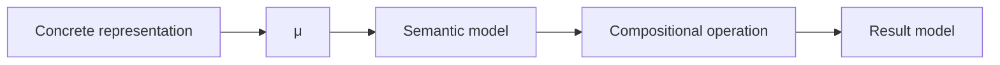

# Denotational Design Spec: <name>

## Purpose and Scope

- Goal:
- In scope:
- Out of scope:
- Source requirements:
- `TODO: Confirm`:

## Domain Types and Denotations

### `<Type>`

- Role:
- Model: `<mathematical model>`
- Meaning: `μ<Type> : <Type> -> <Model>`
- Semantic equality: `x ≡ y iff μ<Type>(x) = μ<Type>(y)`
- Invariants:
- Notes:

## Inline Examples and Diagrams

Use this section instead of external explanatory links when a denotation needs intuition.



Example equation:

```text
μResult(operation value context) = expression(μValue(value), μContext(context))
```

## Operations and Meanings

### `<operation>`

- Type: `<A × B -> C>`
- Meaning: `μC(operation a b) = <expression using μA(a), μB(b), and modeled context>`
- Required context:
- Laws/properties:
- Failure/rejection semantics:

## Algebraic Structure

- Structure:
- Applies to:
- Laws over semantic equality:
- Rationale:
- Non-laws or rejected structures:

## Abstraction Leaks and Design Signals

- Leak or risk:
- Why it is a leak:
- Required redesign, added context, or `TODO: Confirm`:

## Representation and Implementation Constraints

- Valid representation candidates:
- Invalid representation candidates:
- Constraints required to preserve denotation:
- Performance or operational notes that do not redefine meaning:

## Validation Properties

- Property:
  - Given:
  - When:
  - Then:
  - Derived from:

## Agent Handoff

- Safe decomposition tasks:
- Files/APIs likely affected:
- Tests or review checks to create:
- Remaining `TODO: Confirm` items:
