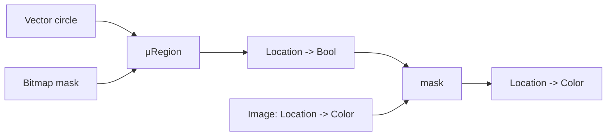
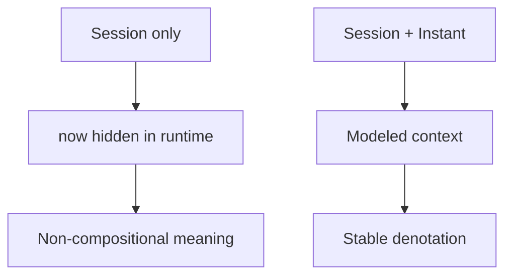

# Denotational Method

Use this reference when the hard part is choosing the model or deciding where the abstraction boundary belongs.

## Core shape

For each domain type:

```text
Type: T
Model: M
Meaning: μT : T -> M
Equality: x ≡ y iff μT(x) = μT(y)
```

The model should be simpler than the implementation. Good models are usually sets, functions, relations, tuples, maps, predicates, streams, traces, or state transition systems.

## Inline example: drawing surface

A drawing system can avoid representation-first design by modeling the visible meaning first:

```text
Location = { x: Real, y: Real }
Color = RGBA
Region model = Location -> Bool
Image model = Location -> Color

μRegion(circle center radius)(p) = distance(p, center) <= radius
μImage(fill color)(p) = color
μImage(mask region image)(p) = if μRegion(region)(p) then μImage(image)(p) else transparent
```

The implementation may later use vectors, rasters, scene graphs, or GPU buffers. Those are valid only if sampling through `μImage` gives the same colors for the same locations.



## Model selection rules

- Use a function model when the object answers queries: `Image ≈ Location -> Color`, `Policy ≈ Principal × Action × Resource -> Decision`.
- Use a set or predicate model when the object selects members: `Region ≈ Location -> Bool`, `TagSet ≈ Set<Tag>`.
- Use a relation when the object connects entities: `DependencyGraph ≈ Set<Node × Node>`.
- Use a sequence, stream, or trace when order is semantically observable: `AuditLog ≈ List<Event>`.
- Use a state transition model when behavior is about allowed evolution: `Workflow ≈ State × Command -> Either<Rejection, State>`.
- Use a tuple/product model when multiple independent meanings must travel together: `DocumentView ≈ RenderedText × Anchors × Metadata`.

## Decomposition rules

Introduce a new type when:

- it has its own stable semantic model
- multiple operations preserve or transform that same model
- hidden assumptions become explicit when the type is named
- the type can carry laws, invariants, or validation properties

Do not introduce a new type when:

- it is only a storage shape
- it exists only to match a framework boundary
- it cannot be explained without naming fields or code paths
- it duplicates another type's model without adding constraints or operations

## Writing operation meanings

For each operation, write:

```text
op : A × B -> C
μC(op a b) = expression using μA(a), μB(b), and modeled context only
```

If an operation needs context, model it in the type:

```text
authorize : Policy × Request × Environment -> Decision
μDecision(authorize p r e) = μPolicy(p)(μRequest(r), μEnvironment(e))
```

Do not smuggle context into prose. If time, identity, configuration, consistency level, locale, tenancy, or failure policy changes the result, it belongs in the model or the operation signature.

### Inline example: hidden time becomes explicit context

Bad equation because it depends on the current clock without naming it:

```text
isExpired : Session -> Bool
μBool(isExpired s) = μSession(s).expiresAt < now()
```

Better equation because time is part of the semantic input:

```text
isExpired : Session × Instant -> Bool
μBool(isExpired s t) = μSession(s).expiresAt < μInstant(t)
```



## Representation boundary

After meanings are stable, implementation notes may say which representations are valid candidates. Keep that section subordinate to the denotation:

```text
Valid representation candidates:
- normalized SQL tables, if queries preserve μOrderBook
- append-only event stream, if replay preserves semantic equality

Invalid candidates:
- lossy cache-only representation, because it cannot reconstruct μAuditLog
```

Representation is correct only when it can implement the meaning function and preserve the stated laws.
