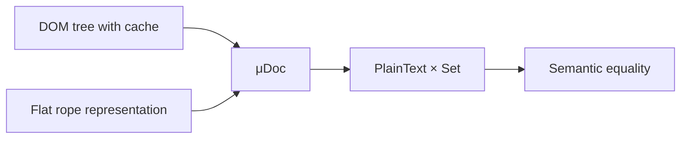
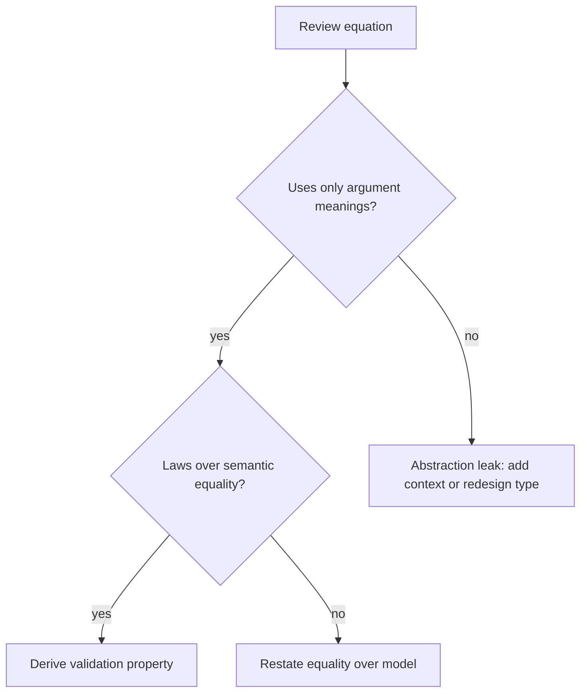

# Laws and Review

Use this reference when checking whether the denotational spec is compositional, lawful, and reviewable.

## Semantic equality

Define equality over models:

```text
x ≡T y iff μT(x) = μT(y)
```

Then write laws with `≡`, not with object identity or serialization unless those are explicitly the model.

Examples:

```text
empty <> x ≡ x
map id xs ≡ xs
render (normalize doc) ≡ render doc
```

Inline example:

```text
Type: NormalizedDocument
Model: PlainText × Set<Anchor>
Meaning: μDoc(doc) = (visibleText(doc), anchors(doc))

Two documents are semantically equal when they show the same text and expose the same anchors,
even if their internal node IDs, whitespace nodes, or cache fields differ.
```



## Common structures

Use these only when the model supports the laws.

### Monoid

Use when values combine with an identity.

```text
empty : T
combine : T × T -> T

Laws:
combine empty x ≡ x
combine x empty ≡ x
combine (combine x y) z ≡ combine x (combine y z)
```

Good fit: regions as union, sets as union, validation errors as accumulation.
Risky fit: ordered logs, last-write-wins records, or effects where order/loss matters unless the model states that behavior.

Inline example:

```text
ValidationErrors ≈ Set<FieldError>
empty = ∅
combine a b = a ∪ b

combine empty x ≡ x
combine x y ≡ combine y x
combine (combine x y) z ≡ combine x (combine y z)
```

The same label is risky for an audit log:

```text
AuditLog ≈ List<Event>
combine a b = a ++ b

Associativity holds, but commutativity does not:
[a, b] ≠ [b, a]
```

### Functor

Use when a structure preserves shape while mapping contained values.

```text
map id x ≡ x
map (g ∘ f) x ≡ map g (map f x)
```

Good fit: lists, trees, optional values, result containers.
Risky fit: APIs where mapping can drop, duplicate, reorder, or fetch external data.

### Applicative or product composition

Use when independent computations or validations combine without depending on each other's results.

```text
pure id <*> v ≡ v
pure f <*> pure x ≡ pure (f x)
```

Good fit: independent validation, form parsing, static configuration assembly.
Risky fit: workflows where the second step depends on the first result; those are usually transition systems or monadic sequencing.

### Homomorphism

Use when a meaning function preserves a structure:

```text
μ(emptyT) = emptyM
μ(combineT x y) = combineM (μ x) (μ y)
```

This is often the cleanest way to state that implementation-level combination is correct.

## Abstraction-leak review

Ask these questions before finalizing:

1. Can two different representations with the same meaning be substituted without changing any specified operation?
2. Does any equation depend on fields, cache state, IDs, timestamps, execution order, or retries that are not in the model?
3. Are there operations that cannot be defined from argument meanings alone?
4. Are equality and laws stated over the model rather than implementation artifacts?
5. Can the laws become tests, property checks, or review criteria?
6. Are ad-hoc combinators reducible to a smaller lawful core?
7. Are representation limitations documented as implementation constraints, not as definitions of meaning?

If any answer fails, either revise the model, add missing context to the signature, split the type, or mark the leak explicitly.



## Validation property patterns

Translate denotations into checks implementation agents can run:

```text
Property: semantic equality is preserved by serialization
Given x : T
When x is encoded and decoded
Then decoded(x) ≡T x
```

```text
Property: combine preserves model combination
For all x, y : T
μ(combine x y) = combineM(μ x, μ y)
```

```text
Property: representation independence
For all r1, r2 : Representation<T>
If μ(fromRep r1) = μ(fromRep r2)
Then observable(op(fromRep r1)) = observable(op(fromRep r2))
```

Prefer properties that compare meanings or observable behavior. Avoid tests that assert private representation unless the representation is the agreed semantic model.
